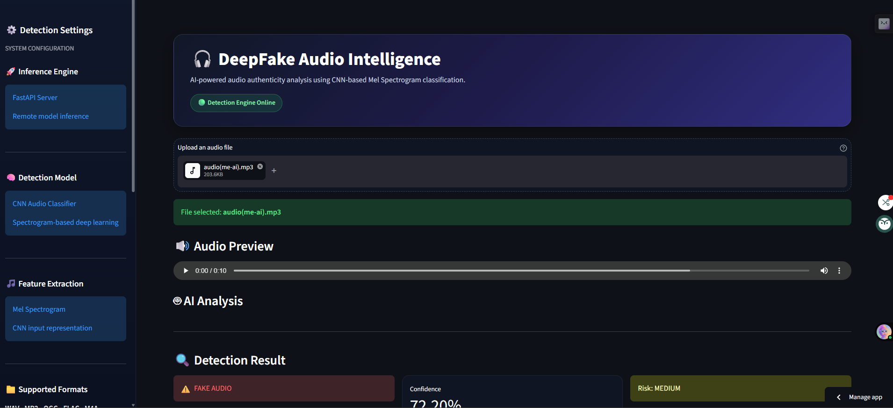
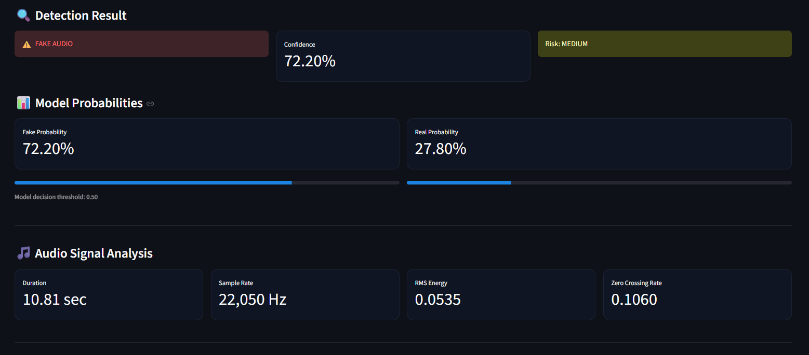
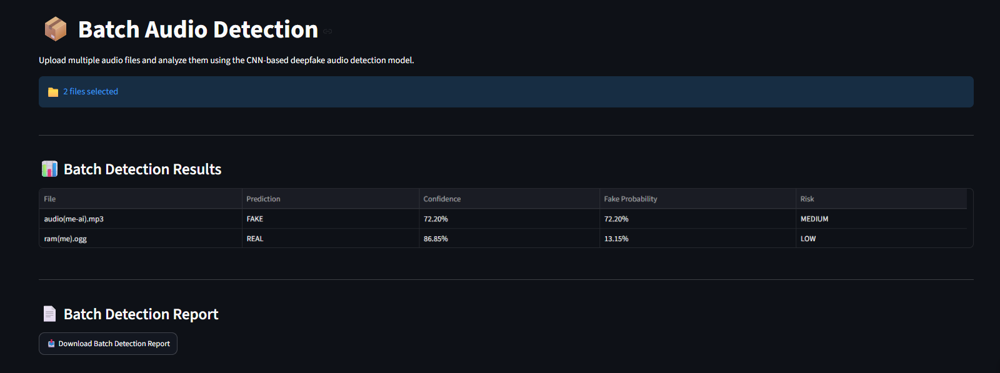
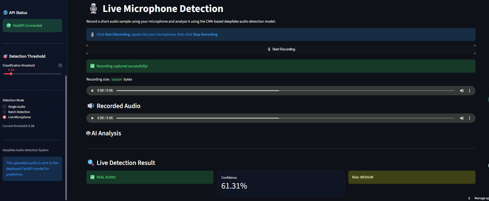
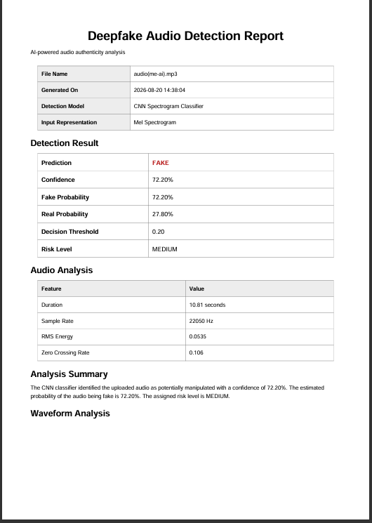
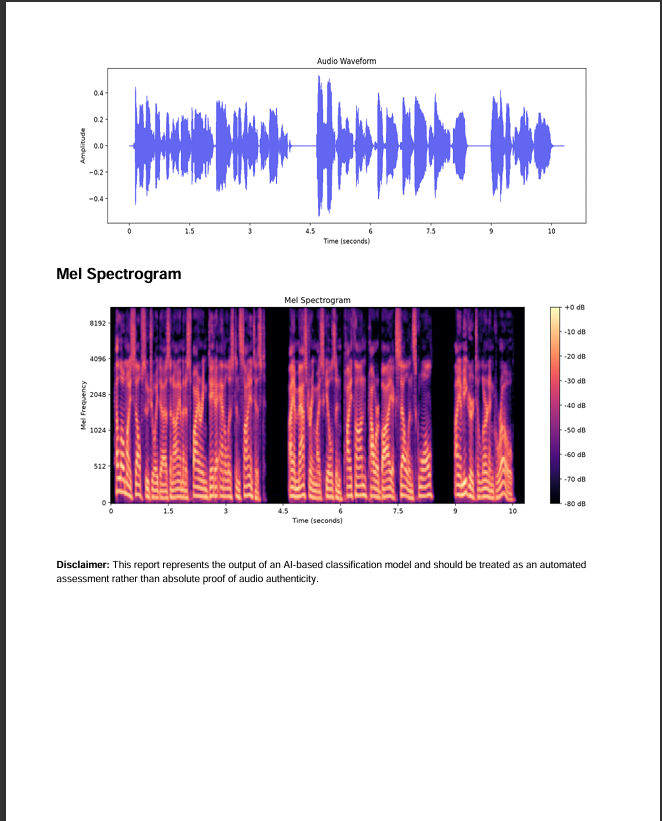

# 🎧 VoxAuth – AI-Generated Speech Detection System

A full-stack Deep Learning application for detecting whether an audio clip is **REAL or FAKE (AI-generated / Deepfake)** using a Convolutional Neural Network (CNN) trained on **Mel Spectrogram features**.

The application provides an interactive Streamlit frontend and a FastAPI backend for model inference. Users can analyze individual audio files, process multiple files in batch, or record audio directly from their microphone.

---

## 🚀 Live Demo

### 🌐 Streamlit Frontend

👉 **[[Frontend URL](https://deepfake-audio-detector-cnn-sujoy.streamlit.app/)]**

### ⚡ FastAPI Backend

👉 **[[FastAPI URL](https://deepfake-audio-detector-6.onrender.com/)]**

---

## ✨ Features

### 🎵 Single Audio Detection

- Upload and analyze an individual audio file
- Supports:
  - `.wav`
  - `.mp3`
  - `.ogg`
  - `.flac`
  - `.m4a`
- Displays audio preview before analysis
- Predicts whether the audio is **REAL** or **FAKE**

### 📦 Batch Audio Detection

- Upload multiple audio files simultaneously
- Analyze each file using the CNN model
- Displays results in a structured table
- Shows:
  - File name
  - Prediction
  - Confidence
  - Fake probability
  - Risk level
- Download a batch detection PDF report

### 🎙️ Live Microphone Detection

- Record audio directly from the browser microphone
- Preview recorded audio
- Send recorded audio to the FastAPI prediction API
- Perform real-time-style authenticity analysis
- Visualize the recorded waveform and Mel Spectrogram
- Download a microphone detection report

### 📊 Model Analysis

For every prediction, the system displays:

- Prediction: **REAL / FAKE**
- Confidence score
- Fake probability
- Real probability
- Detection threshold
- Risk level

### 📈 Audio Signal Visualization

- Audio waveform visualization
- Mel Spectrogram visualization
- Audio duration
- Sample rate
- RMS energy
- Zero Crossing Rate (ZCR)

### 📄 PDF Report Generation

Generate downloadable PDF reports containing:

- File information
- Prediction result
- Confidence
- Fake and real probabilities
- Detection threshold
- Risk level
- Audio features
- Waveform visualization
- Mel Spectrogram visualization

Batch analysis also supports a consolidated PDF detection report.

---

# 🧠 Model Architecture

The detection model is a **Convolutional Neural Network (CNN)** trained using Mel Spectrogram representations of audio signals.

### 🔹 Input Representation

Audio files are converted into Mel Spectrograms and prepared as CNN input.

**Model input shape:**

```text
(128, 120, 1)
```

The preprocessing pipeline uses:

- Sample Rate: `22050 Hz`
- Mel Bands: `128`
- Maximum Spectrogram Length: `120`

Shorter spectrograms are padded, while longer spectrograms are truncated to maintain a consistent model input shape.

---

## 🏗️ CNN Architecture

The model architecture consists of:

```text
Input
   ↓
Conv2D (16 Filters)
   ↓
Batch Normalization
   ↓
Max Pooling
   ↓
Conv2D (32 Filters)
   ↓
Batch Normalization
   ↓
Max Pooling
   ↓
Conv2D (64 Filters)
   ↓
Batch Normalization
   ↓
Max Pooling
   ↓
Flatten
   ↓
Dense (64)
   ↓
Dropout
   ↓
Sigmoid Output Layer
```

The output layer produces a probability representing the likelihood that the input audio is classified as **FAKE**.

```text
Probability > Threshold  → FAKE
Probability ≤ Threshold  → REAL
```

---

# ⚙️ System Architecture

The project uses a frontend-backend architecture.

```text
                     ┌──────────────────────────┐
                     │        User Browser      │
                     └────────────┬─────────────┘
                                  │
                                  ▼
                     ┌──────────────────────────┐
                     │   Streamlit Frontend     │
                     │                          │
                     │ • Single Audio Detection │
                     │ • Batch Detection        │
                     │ • Live Microphone        │
                     │ • Visualizations         │
                     │ • PDF Reports            │
                     └────────────┬─────────────┘
                                  │
                           HTTP POST /predict
                                  │
                                  ▼
                     ┌──────────────────────────┐
                     │      FastAPI Backend     │
                     │                          │
                     │ • Audio Processing       │
                     │ • Feature Extraction     │
                     │ • Model Inference        │
                     └────────────┬─────────────┘
                                  │
                                  ▼
                     ┌──────────────────────────┐
                     │      CNN Model           │
                     │ deepfake_audio_model     │
                     └──────────────────────────┘
```

---

# 🛠️ Tech Stack

## Frontend

- Streamlit
- Streamlit Microphone Recorder
- Requests
- Matplotlib

## Backend

- FastAPI
- Uvicorn

## Machine Learning

- TensorFlow
- Keras
- NumPy
- Librosa

## Reporting

- ReportLab

## Deployment

- Render — FastAPI Backend
- Streamlit Community Cloud — Frontend
- GitHub — Source Code Repository

---

# 📁 Project Structure

```text
deepfake-audio-detector/
│
├── app/
│   ├── main.py
│   ├── streamlit_app.py
│   ├── utils.py
│   ├── config.py
│   ├── app_logger.py
│   ├── explainability.py
│   └── report_generator.py
│
├── model/
│   └── deepfake_audio_model.keras
│
├── audio-samples/
│
├── notebooks/
│   └── audio detection analysis.ipynb
│
├── requirements.txt
├── README.md
├── .gitignore
└── .python-version
```

---

# ⚙️ Installation and Local Setup

## 1️⃣ Clone the Repository

```bash
git clone https://github.com/Alenbert009/deepfake-audio-detector.git
cd deepfake-audio-detector
```

---

## 2️⃣ Create a Virtual Environment

### Windows

```bash
python -m venv .venv
```

Activate it:

```bash
.venv\Scripts\activate
```

---

## 3️⃣ Install Dependencies

```bash
pip install -r requirements.txt
```

---

## 4️⃣ Run the FastAPI Backend

```bash
uvicorn app.main:app --reload
```

The backend will run locally at:

```text
http://127.0.0.1:8000
```

You can access the API documentation at:

```text
http://127.0.0.1:8000/docs
```

---

## 5️⃣ Run the Streamlit Frontend

Open another terminal and activate the virtual environment.

Then run:

```bash
streamlit run app/streamlit_app.py
```

The Streamlit application will open in your browser.

---

# 🔌 API Endpoint

## `POST /predict`

Uploads an audio file and returns the deepfake detection result.

### Example Response

```json
{
  "filename": "audio.wav",
  "prediction": "FAKE",
  "confidence": 0.67,
  "probability_fake": 0.67,
  "probability_real": 0.33,
  "threshold": 0.2,
  "risk": "MEDIUM",
  "features": {
    "duration": 5.42,
    "sample_rate": 22050,
    "rms": 0.0432,
    "zcr": 0.0821
  }
}
```

---

# 🎯 Detection Logic

The model produces a probability between `0` and `1`.

```text
Fake Probability > Threshold → FAKE
Fake Probability ≤ Threshold → REAL
```

The current default threshold is:

```text
0.20
```

> The threshold can be adjusted in the frontend interface for experimentation and analysis. The actual prediction threshold is determined by the backend model configuration.

---

# ⚠️ Important Testing Note

Live microphone detection depends heavily on audio quality and recording conditions.

For example, playing AI-generated audio through a phone speaker and recording it using another microphone can cause the audio characteristics to change because of:

- Speaker distortion
- Room acoustics
- Background noise
- Microphone characteristics
- Compression
- Recording quality

Therefore, an AI-generated audio clip played through a physical speaker may sometimes be classified differently from the original digital audio file.

For best testing results:

1. Test the original audio file directly.
2. Test multiple REAL audio samples.
3. Test multiple AI-generated audio samples.
4. Compare prediction probabilities.
5. Test microphone recordings separately.
6. Avoid relying on a single prediction as definitive forensic evidence.

---

# 📊 Model Limitations

This project is intended as a Deep Learning and audio analysis application.

The predictions are probabilistic and depend on:

- Training data quality
- Dataset diversity
- Class balance
- Audio duration
- Recording environment
- Noise
- Compression
- Speaker characteristics
- Microphone quality
- AI voice generation method

The current system should **not be considered forensic-grade evidence**.

---

# 🔮 Future Improvements

- Improve model accuracy using larger and better-balanced datasets
- Train with more diverse real and synthetic voices
- Add data augmentation
- Improve noise robustness
- Add explainable AI visualizations
- Support longer and variable-length audio
- Add model confidence calibration
- Implement authentication and user history
- Add database support
- Add asynchronous batch processing
- Deploy using Docker
- Add automated testing and CI/CD
- Explore advanced architectures such as:
  - CNN + LSTM
  - CRNN
  - Transformer-based audio models
  - Pre-trained speech representation models

---

# 📸 Screenshots

### 🏠 Main Dashboard



### 🎵 Single Audio Detection



### 📦 Batch Detection



### 🎙️ Live Microphone Detection



### 📄 Detection Report 1st Page



### 📄 Detection Report 2nd Page


---

# 📜 License

This project is licensed under the MIT License.

---

# 🙌 Acknowledgements

- ASVspoof Dataset
- TensorFlow
- Keras
- Librosa
- FastAPI
- Streamlit
- Render
- Streamlit Community Cloud

---

# 👨‍💻 Author

**Sujoy Dass**

GitHub: https://github.com/Alenbert009

---

⭐ If you found this project interesting, consider giving the repository a star!
